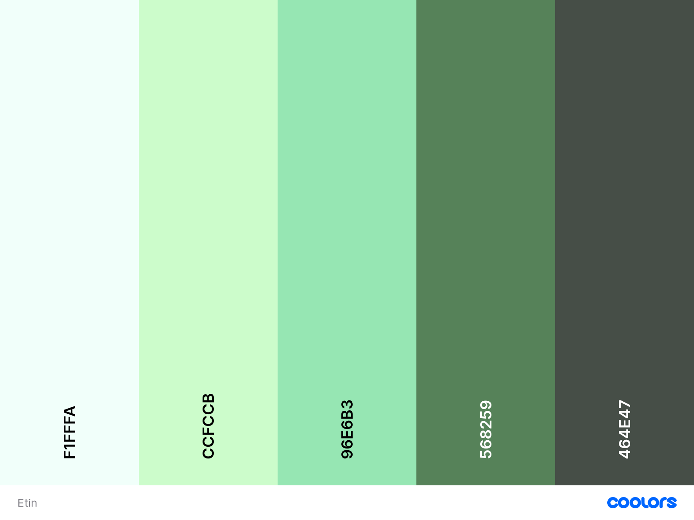

<h1 align="center" id = "introduction">
     
     Project Eatin
</h1>

<h2 align="center">
    <a href=""target="_blank">Eatin Website</a>
</h2>

*Eatin*, a website to search, log and share to the public home dining ideas.
 
The site design is to help the user be able to search recipes with ease and to define and store their own recipes clearly.

This is the third project of a four module Full Stack Developer course provided by the [Code Institute](https://codeinstitute.net/).
Main requirements are to build a full stack site to help users manage a common dataset using HTML, CSS, JavaScript, JQuery, Python+Flask, MongoDB, Additional Libraries and external API's.

## Contents
1. [UX](#UX)
    - [Aims](#Aims)
    - [Demographic](#Demographic-both-current-and-potential)
    - [User Stories](#User-stories)
        - [Browsers](#Browsers)
        - [Members](#Members)
        - [Web developer](#Web-Developer)
    - [Development](#Development-Plan)
        - [Strategy](#Strategy)
            - [Demographic](#Demographic)
            - [Audience](#Understanding-the-audience)
            - [Requirements](#User-requirements)
            - [Importance levels](#Levels-of-importance)
        - [Design and Scope](#Design-and-Scope)
            - [Influence](#Influence)
            - [Imagery](#Imagery)
            - [Pages](#Page-sections)
            - [Structure](#Structure)
    - [Wireframe](#Wireframe)
2. [Features](#Features)
    - [Database](#Database)
    - [Consistency](#Consistency)
    - [Home](#Home-page)
    - [Login](#Login-page)
    - [Registration](#Registration-page)
    - [Profile](#Profile-page)
    - [Recipe create or edit page](#Recipe-create-or-edit-page)
    - [Contact](#Contact-page)
    - [Browse](#Browse-page)
    - [Recipe view from browse page](#Recipe-view-from-browse-page)
    - [Recipe view from profile page](#Recipe-view-from-profile-page)
3. [Technologies Used](#Technologies-Used)
4. [Testing](#Testing) / [Test detail file]() ---- ?!
    - [Commits](#Commits)
    - [Code testing](#Code-testing)
    - [Element testing](#Element-testing)
    - [Device testing](#Device-testing)
    - [Colour blindness Testing](#Colour-blindness-testing)
    - [Browser testing](#Browser-testing)
    - [User testing](#User-testing)
5. [Deployment](#Deployment)
    - [Gitpod commits](#Gitpod-to-GitHub-commits)
    - [GitHub Pages Deployment](#Deploying-via-GitHub-Pages)
    - [Forking](#Forking-repository)
    - [Cloning](#Cloning-a-repository)
6. [Credits and Acknowledgements](#Credits-and-Acknowledgements)

***
 --- ?!
***

## UX

### Aims

1. To give users a visual experience of dining ideas with interactive features.

2. Easy navigation.

3. Responsive to all screens, sizes and browsers.

4. Comfortable and clear understanding of data storage capability.

### Demographic both current and potential

* Users who are looking for dining ideas.
* Users who want to have a place to store/log their recipe ideas.
* People who want to share their recipes with the public.
* Developers

### User stories

#### Browsers
The user is wanting to find dining ideas
*   This user wants to:
1. Be able to navigate through the website easily.
2. Learn about various recipes.
3. Be able to navigate to relevant social links.
4. Be able to make contact for queries and newsletter sign up.

#### Members
The user is wanting to find, store and share dining ideas
*   This user wants to:
1. Be able to navigate through the website easily.
2. Learn about various recipes.
3. Have the opportunity to save their favourite recipes.
4. Be able to navigate to relevant social links.
5. Be able to make contact for queries, technical issues and newsletter sign up.
6. Be able to create, read, update and delete their profile and recipe data.

#### Web Developer
This user is looking for imagery or influence for another project.

* They want to be able to:
1. Have easy navigation.
2. Find how the website was created.
3. Be able to see sources for design.
4. Be able to make contact with Developer.
5. Have an opportunity to clone site if wanting to use content.

[Back to top ⇧](#introduction)

### Development Plan
Development decisions based on change in design appeal for more creativity in part with interactivity with a database (MongoDB).

[Back to top ⇧](#introduction)

#### Strategy
Identifying target audience.

##### Demographic
1. People starting to to get more cooking recipe ideas
    *18-80 years old
2. Web developers
    * 3rd stage students with basic HTML, CSS, Javascript, JQuery, Python+Flask, MongoDB knowledge

##### Understanding the audience
1. Personality
    * Creative.
    * People who may be fed up of ordering takeaways or dining out.
    * Student cooks.
    * Cooks or Chefs currently in the industry.    
2. Lifestyle
    * Earnings variable.
    * Families.
    * Couples.
    * People who live alone.

##### User requirements
1. User
    * Search particular foods or recipe types.
    * Register or login to profile.
    * Able to create, read, update, delete profile and recipe data.
    * Make contact directly or through social sites.

2. Developer
    * Develop online presence through interactive actions on website.
    * Provide recipe ideas.
    * Capture data of new and existing recipes through reliable database.

##### Levels of importance
Below are areas considered for levels of importance and viability

<u>Importance</u>
1. High
    * Online presence.
    * Imagery.
    * Interactivity.
    * Contact portal.
    * Search function.
    * Profile registration and logging.
    * Recipe creation, read, update and delete function.
2. Medium
    * Links to social sites.
3. Low
    * Sales
    * Favourites bookmark

<u>Viability</u>
1. High
    * Imagery.
    * Links to social sites.
    * Interactivity.
2. Medium
    * Contact portal.
    * Recipe creation, edit and delete function.
    * Profile registration and logging.
3. Low
    * Sales
    * Search function.
    * Online presence.
    * Favourites listing.

[Back to top ⇧](#introduction)

### Design and Scope

#### Influence
1. Learning to personally cook at home.
2. A great wife who is a fanatastic cook with some education in the art of cooking.  
3. Image of food:
    * 

#### Imagery
1. Colours
    *   Contrasting bright and pastel greens.
2. Imagery
    * Associations to:
        * Food
        * Eating
        * Dining
        * Creativity

#### Page sections
1. Home
2. Login
3. Registration
4. Profile
5. Recipe Creation / Edit
6. Contact
7. Browse
8. Recipe read from browsed
9. Recipe owners from profile
*  Potential pages to develop
    1. Merchandise sales

#### Structure

Hierarchical structure design for simpler user navigation:

[Back to top ⇧](#introduction)

### Wireframe

- Designed in [Figma]()

- Desktop version

- Tablet version

- Mobile version

[Back to top ⇧](#introduction)

## Features
This site has several pages for user to easily identify section associated. Menu dependancy on user being a member or non-member. Front end association to back end database.

### [Database](database.md)
- MongoDB used to store data under database name "eatinDB"
    * Collections to store specific data:
        * members
        * recipe

### Consistency

- Design with menu placed in the same position at top left.
    * A logo which leads the user back to 'Home' when clicked.
    * To have associated selections dependant on user being a member or non-member.
    * Menu links to associated pages.

- Logo linking to home page in every page.

- Footer with links to social media and logo linking to Home page.

- Consistent font:
    * Poppins
    * Pacifico
    * to use additional in case Poppins or Pacifico isn't available for users:
        * Arial & sans serif

- Colours (although may vary to suit):
    * mintcream
        * #f1fffa / #fff / hsl(158,100%,97%) / rgb(241,255,250)
    * teagreen / gainsboro
        * #ccfccb / #dfd / hsl(118,89%,89%) / rgb(204,252,203)
    * celadon / palegreen
        * #96e6b3 / #9eb / hsl(141,61%,74%) / rgb(150,230,179)
    * middlegreen / dimgray
        * #568259 / #586 / hsl(124,20%,42%) / rgb(86,130,89)
    * ebony / darkslategray
        * #464e47 / #454 / hsl(127,5%,29%) / rgb(70,78,71)

*

[Back to top ⇧](#introduction)

### Home page
1. Backdrop
    - Hero food image.

2. Synopsis
    - Site description

3. Menu
    - Leading non-member to
        * Login
        * Register
        * Browse
        * Contact
    - Leading member to
        * Browse
        * Contact
        * View profile
        * Create new recipe

### Login page
1. Backdrop.
    - Get ready to cook image

2. Input fields.
    - Email
    - Password

3. Login button
    - Data read by database and if correct allows user access
    - If incorrect a warning is flashed to state email or password is incorrect

4. Password reset option.
    - To make active member false and produce email providing alternative password to reactivate (make member true) account

5. If in wrong section, description to direct to registration.

6. If already logged in this option is to not be available in Menu.

7. Menu
    - Leading non-member to
        * Home
        * Register
        * Browse
        * Contact
    - Leading member to
        * Home
        * Browse
        * Contact
        * View profile
        * Create new recipe

[Back to top ⇧](#introduction)

### Registration page
1. Backdrop.
    - ingredients image

2. Input fields.
    - First name
    - Surname
    - Email (to be used as unique username)
    - Password

3. Register button if details correct.
    - Data is passed through to MongoDB and member is made true

4. Warning if detail format incorrect.

5. If already registered, warning to state so and to direct user to Login page.

6. Menu
    - Leading non-member to
        * Home
        * Login
        * Browse
        * Contact
    - Leading member to
        * Home
        * Browse
        * Contact
        * View profile
        * Create new recipe

### Profile page
1. For members logged in only, non members will not be able to view.

2. Welcome flash description.

3. Profile details - associated to database under members collection.
    - Edit function
    - Save function
    - Delete account function

4. Recipes - associated to database under recipe collection.
    - Saved public recipes
    - Saved private recipes
        - to be used in case member wants to save as a draft prior to pushing into Public Search database
    - Ability to add a new recipe

5. Menu.
    - Home
    - New Recipe
    - Browse
    - Contact

[Back to top ⇧](#introduction)

### Recipe create or edit page
1. For members logged in only, non members will not be able to view.

2. Data to be created or edited within the recipe collection

3. Editable Recipe input fields.
    - Name
    - Description
        * Max length requirement
    - Image upload
    - Serves
    - Preperation time
    - Cooking time
    - Food
    - Count
    - Size
    - Weight
    - Volume
    - Step by step instructions
        * Max length requirement
    - Additional or Tips
        * Max length requirement

4. Other fields.
    - Ready in Time
        * sum of Preperation and cooking time
    Recipe Types
        * Radio selections
        * Breakfast
        * Lunch
        * Dinner
        * Dessert
        * Snack

5. Buttons.
    - Add
        * To add fields
    - Delete
        * To delete field
    - Cancel
        * To cancel and remove data in fields
        * Warning message to appear prior to cancellation
    - Save and share publicly
        * To save to profile and make available for it to be publicly searched
    - Save and keep private
        * To save to profile for own private viewing
        * Can be used for test scenarios
        * Member may want to keep private

6. Links
    - Back to profile link.
        * Warning to save any updates if any have been made

7. Menu.
    * Warning to save any updates if any have been made
    - Home
    - New Recipe
    - Profile
    - Browse
    - Contact

[Back to top ⇧](#introduction)
    
### Contact page
1. Contact fields
    - including a dropdown of subject description list
        * Newsletter
        * Technical issue
        * Share idea
        * Other

2. Associated to EmailJS

3. Email to Developer and User Auto Reply with appropriate message and link to site.

4. Menu
    - Leading non-member to
        * Home
        * Login
        * Registration
        * Browse
    - Leading member to
        * Home
        * Browse
        * View profile
        * Create new recipe

### Browse page
1. Search function.
    - Search bar for particular foods
        * To have ability to find several foods and ignore anything that is not alphabetical
    - Filter - more than one can be selected
        * Recipe Types
            * Breakfast
            * Lunch
            * Dinner
            * Dessert
            * Snack
    - Ready in Time slider
        * Slider to adjust when meals can be cooked and prepared in for user in case they want a quick meal
    - Search button - once selections have been made
        * Otherwise suggestions are provided
    - Favourites
        * Where a user has bookmarked favourites, these can also be listed by pressing this button <--- may not be used ---> ?!

2. Recipe summary cards.
    - Several recipes listed either based on search, favourites or suggestions.
    - Details to show:
        * Image
        * Name of recipe
        * Ready time
    - Amount of recipe summaries shown dependant on screen size.

3. Menu
    - Leading non-member to
        * Home
        * Login
        * Registration
        * Contact
    - Leading member to
        * Home
        * Contact
        * View profile
        * Create new recipe

[Back to top ⇧](#introduction)

### Recipe view from browse page
1. Search function - This so the user can re-search at current page.
    - Search bar for particular foods
        * To have ability to find several foods and ignore anything that is not alphabetical
    - Filter - more than one can be selected
        * Recipe Types
            * Breakfast
            * Lunch
            * Dinner
            * Dessert
            * Snack
    - Ready in Time slider
        * Slider to adjust when meals can be cooked and prepared in for user in case they want a quick meal
    - Search button - once selections have been made
        * Otherwise suggestions are provided
    - Favourites
        * Where a user has bookmarked favourites, these can also be listed by pressing this button <--- may not be used ---> ?!

2. Recipe selection - Details provided by members who have shared publicly or via recipe shared database.
    - Name
    - Favourite bookmark
    - Image
    - Description
    - Serves
    - Ready in Time
    - Cooking Time
    - Prep Time
    - Ingredients
    - Method
    - Additional Tips

3. Back to Search links

4. Menu
    - Menu
    - Leading non-member to
        * Home
        * Login
        * Registration
        * Contact
        * Browse
    - Leading member to
        * Home
        * Contact
        * View profile
        * Create new recipe
        * Browse

[Back to top ⇧](#introduction)

### Recipe view from profile page
1. For members logged in only, non members will not be able to view.

2. Search function - This so the member can re-search at current page.
    - Search bar for particular foods
        * To have ability to find several foods and ignore anything that is not alphabetical
    - Filter - more than one can be selected
        * Recipe Types
            * Breakfast
            * Lunch
            * Dinner
            * Dessert
            * Snack
    - Ready in Time slider
        * Slider to adjust when meals can be cooked and prepared in for member in case they want a quick meal
    - Search button - once selections have been made
        * Otherwise suggestions are provided
    - Favourites
        * Where a member has bookmarked favourites, these can also be listed by pressing this button <--- may not be used ---> ?!

3. Recipe selection - Details provided by members who have shared publicly or via recipe shared database.
    - Name
    - Favourite bookmark
    - Image
    - Description
    - Serves
    - Ready in Time
    - Cooking Time
    - Prep Time
    - Ingredients
    - Method
    - Additional Tips

4. Back to Profile links

5. Menu
    * Home
    * Contact
    * View profile
    * Create new recipe
    * Browse

[Back to top ⇧](#introduction)

## Technologies Used

- HTML5
    * Code used to provide content to the website

- CSS3
    * Code used to style content

- Javascript
    * Code used to provide more interactive attributes

- [JQuery](https://code.jquery.com)

- [Python](https://www.python.org)
    * When coding to ensure script is PEP8 compliant

- Flask
    * Mainly for Jinja templating

- [MongoDB](https://www.mongodb.com)

- [Heroku](https://www.heroku.com)

- [Coolors - colour collage](https://coolors.co)

- [Picjumbo](https://picjumbo.com)

- [Freeimges](https://www.freeimages.com)

- [Clipartmax](https://www.clipartmax.com)

- [Github](https://github.com)

- [Gitpod](https://www.gitpod.io)

- [Bootstrap](https://getbootstrap.com)

- [MDBootstrap version 4](https://mdbootstrap.com)

- [Materialize](https://materializecss.com) ---?!

- [Google fonts](https://fonts.google.com)

- [Figma]() --- ?!
    * [project wireframe]

- [Random Key Generator](https://randomkeygen.com)

- [Font Awesome](https://fontawesome.com)

- [Bootstrapcdn](https://www.bootstrapcdn.com)

- [Werkzeug](https://werkzeug.palletsprojects.com/en/2.0.x)

- [cdnjs](https://cdnjs.com)

- [EmailJS](https://www.emailjs.com)

- [Codepen](https://codepen.io)

- [Am I responsive](http://ami.responsivedesign.is)

- [HTML code checker](https://validator.w3.org)

- [CSS code checker](https://jigsaw.w3.org/css-validator)

- [JS Hint JavaScript validator](https://jshint.com/)

- [Gif Compessor](https://www.freeconvert.com/gif-compressor)

- [Browser site testing - BrowserStack](http://browserstack.com)

- [RGBlind chrome extension]

- [Eye Dropper extension]

[Back to top ⇧](#introduction)

## Testing 
-   ### View [TEST.md file]() --- ?!

### Commits

- Over 130 commits --- ?!

### Code Testing
- HTML 
- CSS
- JavaScript
- JQuery
- Python

### Element testing
- Ensure elements behave as expected
   
### Device testing

- [Am I responsive](http://ami.responsivedesign.is)

### Colour blindness testing

- RGBlind Chrome extensions

### Browser testing

- Chrome
    - main area of testing
- Firefox
- Microsoft Edge
- Safari

### User Testing

- Friends & Family testing

[Back to top ⇧](#introduction)

## Deployment

### Gitpod to GitHub commits

To help with controlling versions you can commit to GitHub via Gitpod.
Once you are able to view the repository in Gitpod this is done by:

1. Access the control terminal
    - Usually found at bottom of project in "workspace" section.
2. Next to gitpod/workspace/(name of project)
    - Type "git add (and name of document you wish to commit to GitHub)".
    - If you want to find all that could be committed then you can type "git add ."
3. Type "git status"
    - This will help show what files have been modified, added or deleted for a pre-check prior to committing.
4. Type "git commit -m ("and then a brief description of latest updates in quotation marks")"
5. Type "git push"
6. Log into GitHub
    - Locate repository
    - You should be able to see the latest and history of commits in code section at top right of table of files list.
    *  --- ?!
    

### Deploying via GitHub Pages / Heroku

#### Heroku dependancies

- In order to deploy to Heroku initial files need to be set up to run the app.
    1. Applications
        * requirements.txt-  Lists the requirements to deploy to Flask
        * Procfile (capital P)

#### Heroku deployment

- An account will need to be registered with Heroku to deploy projects and create applications.To begin deployment:
    1. Once registered you can select "Create new app".
    2. Provide a unique app name in all lowercase letters but individual words are to be separated with a "-" and no spaces.
    3. Select region closest to you, in this case Europe.
    4. Automatic deployment can be done via the GitHub repository where this project is stored.
    5. Select connect to GitHub button and when pressed make sure your GitHub profile is displayed and then add your repository name in "repo-name" field and click search.
    6. Once the repository is found, click "Connect" to connect to this app.
    7. For thie project DO NOT PRESS "ENABLE AUTOMATIC DEPLOYS" YET !!
        - This is because there are sections in files not deployed to GITHUB that need to be manually enabled first.
    8. Select "Settings".
    9. Select "Reveal Config Vars".
    10. Sections within env.py file are added to this section.
    11. WARNING: Ensure requirements.txt & Procfile are added to repository prior to Heroku deployment or Heroku will not see these when connecting.
    12. Within Heroku you should now be able to safely press the "Enable Automatic Deploys" button. Select Deploy section to view.
    13. Select "ENABLE AUTOMATIC DEPLOYS".
    14. Select "Deploy Branch" after selecting which version you wish to deploy. Then Wait for Heroku to load all files.
    15. Once done you should see "Your app was successfully deployed" and a "View" button.
    16.  Select "View" button to launch the app.
    17. As this is connected to GitHub, Heroku will obtain changes when these are pushed to the GitHub repository.

#### DEBUG
- Ensure within app.py change "debug=True" to "debug=False"

1. Log into GitHub and look for [https://github.com/TezBaydu/Milestone-Project-3-Cooking] or create an account.
2. Click on settings and ensure repository name is selected to Milestone-Project-3-Cooking.
3. Select 'Pages' in menu section and ensure Branch is 'Master' and folder is 'root'.
4. Click save and wait for site to be published.
5. Click link in GitHub Pages section to view published site.

### Forking repository

Forking a repository in GitHub is used to make a copy of a repository which you do not have rights access to. Once you have forked a repository you will be able to make changes without affecting the original. It can also be used to suggest changes of an original project and/or propose a project as starting point.

Steps on Forking a repository:
1. Log into GitHub and look for [https://github.com/TezBaydu/Milestone-Project-3-Cooking] or create an account.
2. At the top right hand corner of the page select "Fork".
3. You should now have a copy of the original repository to work with on your account without affecting the original.

### Cloning a repository

Cloning a repository in GitHub allows you to make a copy of your own repository which will affect the original repository.
If you wish to make changes which do not affect the original then this should be forked.

Steps to Clone a repository
1. Log into GitHub and look for [https://github.com/TezBaydu/Milestone-Project-3-Cooking] or create an account.
2. Ensure "Code" has been selected in menu.
3. Select code on top right of table.
4. Select either HTTPS, SSH or CLI.
5. You can either download ZIP for static files and utilise in GitHub or open with GitHub desktop.
6. If opening with GitHub Desktop then select. If not downloaded this will need to be to utilise benefits.
7. Once opened with GitHub Desktop select "File".
8. Select "Clone repository".
9. Select GitHub and the name of the GitHub repository. (URL can also be selected and the URL applied)
10. Select repository from the sources.
11. Click "Choose".
12. Click "Clone".

For further help and info you can select [Cloning and Forking repositories](https://docs.github.com/en/desktop/contributing-and-collaborating-using-github-desktop/cloning-and-forking-repositories-from-github-desktop)

[Back to top ⇧](#introduction)

## Credits and Acknowledgements

- [Code Institute](https://codeinstitute.net/)
    * Tutor Support have been amazing
    * Seun Owoni Koko for her enthusiasm, guidance and support
    * Slack channel

- [Codepen](https://codepen.io/)
    * Excellent source to view and test code

- [Stack overflow](https://stackoverflow.com/)
    * For the general queries that have happpened and the various solutions as guidance

- Website Designers
    * For their help in testing Mac version and advice on design

- Friends and Family
    * For their patience, advice and support

[Back to top ⇧](#introduction)

## Potential issues

### Done
- last_name variable to be defined in profile - done
- email variable to be defined in profile - done
- recipe creation to database success but unable to display details in profile - done, did not call the name "member_recipe"
- Profile image card sizing, due to it being a URL as email from Code advised... how to limit or max image size? - done
- Input number in recipe form accepts --9879798798 even when limiting maxlengths...? - done
- Steps section js not activated - should it match table above for ingredients? - No - Updated to self styles row inputs
- Profile UX adjustment, profile card on left, recipes on right - done
- Profile: button to take user to create recipe - done
- Profile: Public and Private recipes to alternaelty show upon selection - done through using accordion collapse
- Recipe: recipe image text box had 1.02 container - Done - had to move end textarea to same line....?!
- Profile: Line 81:  section not recognised?! - Done Python does not like "-" hyphens !!!
- Recipe: Dict applied and Array in MongoDB but is not listing - Done Getlist applied after Slack search
- Menu nav blocking other actions due to it being fixed and extends whole width - Done - Row positoin made absolute and adjusted position of feature
- Profile: Recipe card body to be adjusted so is responsive including image size - Done
- Recipe: repeat field showing but value is null - Done
- Profile: Edit and delete buttons on recipe cards - Done and Edit action working
- Create recipe: change upload to accept URL as source - Almost done but has content within... - Done
- Create recipe: add button underneath - done
- Create recipe: delete on ingredients deleting parent but sibling deletion not working... - done, added container div
- Create recipe: method step adding and deleting but placeholder not showing and unable to resize added fields - done missing closing '"' in JS script
- Browse: Search bar started but needs refining - Done

### To Do
- Browse: App.py update to pull in public recipes only from all members, currently pulling in recipes from members
- Recipe: current date applied but doesn't applt to MongoDB
- Edit recipe: array values to populate separate divs rows
- Edit recipe: quantity values not populateing value, however is an issue with array still
- Col classes have padding right 15px and will not fill page
- iphone 5 nav menu items not listed correctly
- background image not showing
- Profile: New member - Accordion to have a Create Recipe button in Accordion which gets replaced when a recipe is created
- Create recipe: Ready in sum | Event listeners in prep and cook to publish sum in ready time

