<h1 align ="center" id = "top">Eatin Test file
<h1>

<h2 align="center">
    <a href="https://eatin-project.herokuapp.com/" target="_blank">Eatin Website</a>
</h2>

<h3 align="center">
    <a href="https://github.com/TezBaydu/Milestone-Project-3-Cooking#README" target="_blank">Back to README file</a>
</h3>

## Contents
1. [Commits](#Commits)
2. [User Story testing](#User-Story-testing)
    - [Browsers](#Browsers)
    -[Members](#Members)
    - [Web Developer](#Web-Developer)
3. [Code testing](#Code-testing)
    - [HTML5](#HTML5)
    - [CSS3](#CSS3)
    - [JavaScript](#JavaScript)
    -[PEP8](#Python-PEP8)
4. [Element testing](#Element-testing)
    - [Navigation bar](#Navigation-bar)
    - [Scroll Top button](#Scroll-Top-button)
    - [Footer](#Footer)
    - [Locations section](#Locations-section)
        * [Read More](#Read-More)
        * [Map Markers](#Map-Markers)
        * [Interest Cards](#Interest-Cards)
    - [Contact section](#Contact-section)
    - [Email format](#Email-format)
5. [Device testing](#Device-testing)
6. [Colour blindness testing](#Colour-blindness-testing)
    - [Protanopia](#Protanopia)
    - [Deuteranopia](#Deuteranopia)
7. [Browser testing](#Browser-testing)
8. [User testing](#User-testing)
    - [Bugs and Issues](#Bugs-and-Issues)

## Commits
- Over ---!?!--- commits
- Commits made in as many instances as possible

[Back to top ⇧](#top)

## User Story testing

### Browsers
The user is wanting to find dining ideas

* This user wants to:
1. Be able to navigate through the website easily.
2. Learn about various recipes.
3. Be able to navigate to relevant social links.
4. Be able to make contact for queries and newsletter sign up.

### Members
The user is wanting to find, store and share dining ideas
*   This user wants to:
1. Be able to navigate through the website easily.
2. Learn about various recipes.
3. Be able to navigate to relevant social links.
4. Be able to make contact for queries, technical issues and newsletter sign up.
5. Be able to create, read, update and delete their profile and recipe data.

### Web Developer
This user is looking for imagery or influence for another project.

* They want to be able to:
1. Have easy navigation.

2. Find how the website was created.
    - [README.md](https://github.com/TezBaydu/Milestone-Project-3-cooking#introduction) file created detailing why and how website was created.
    - Contact form can also be used for General enquiries.
3. Be able to make contact with Developer.
    - Contact form can be used for general enquiries.
    - [README.md Deployment](https://github.com/TezBaydu/Milestone-Project-3-cooking#Deploying-via-GitHub-Pages) has description of cloning and forking and therefore contact can be made via GitHub.
4. Have an opportunity to clone site if wanting to use content.
    - [README.md Cloning](https://github.com/TezBaydu/Milestone-Project-3-cooking#Cloning-a-repository) has description of cloning.

[Back to top ⇧](#top)

## Code Testing

### HTML5
- [HTML code checker](https://validator.w3.org/)
     
    - Test date 09/10/2021
        - HTML5 test
            * Home
                - 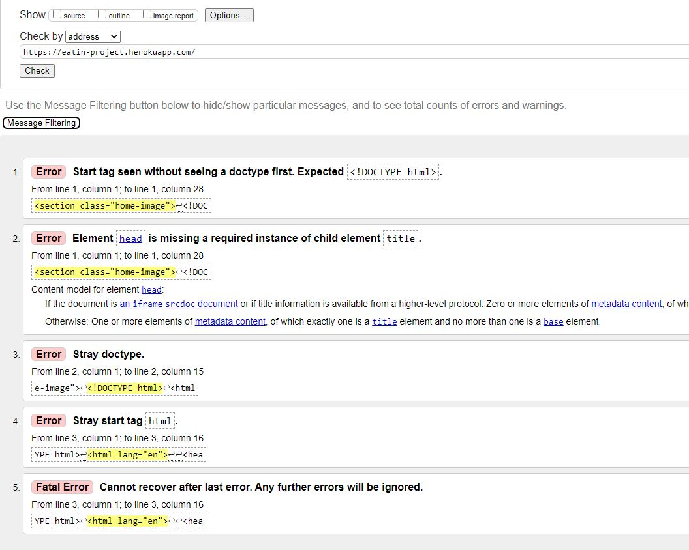
                    * Adjustments:
                        * Created block in base.html to capture image classes in templates and still cover page sources.
                    * Post adjustments
                - 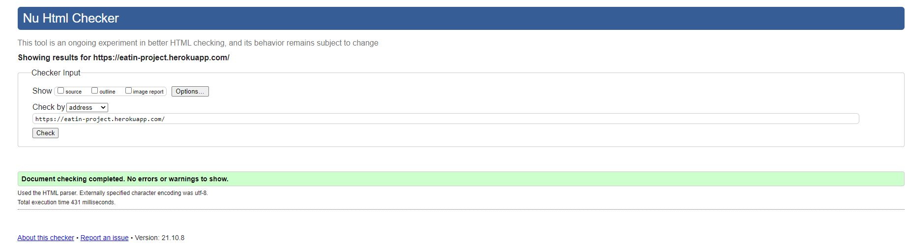
            * Browse
                - 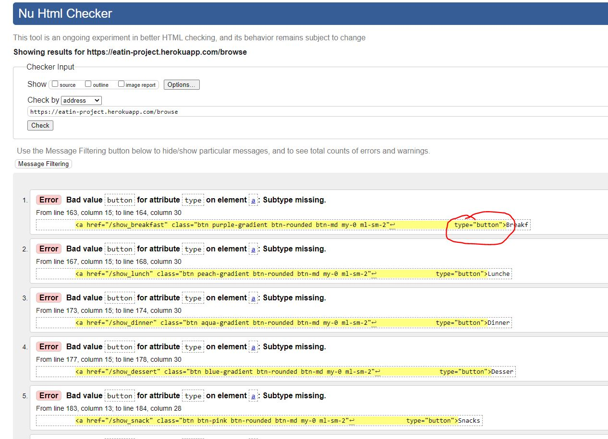
                    * Adjustments:
                        * Type=button removed from <a> tags and type=textfrom <textare> tags
                - 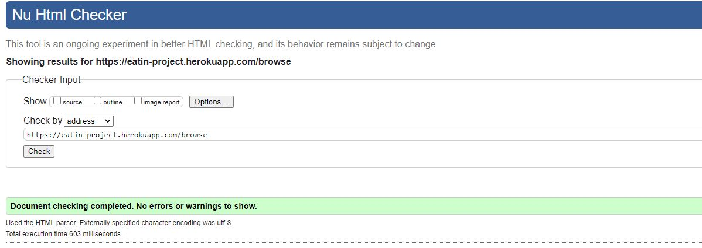
            * Contact
                - 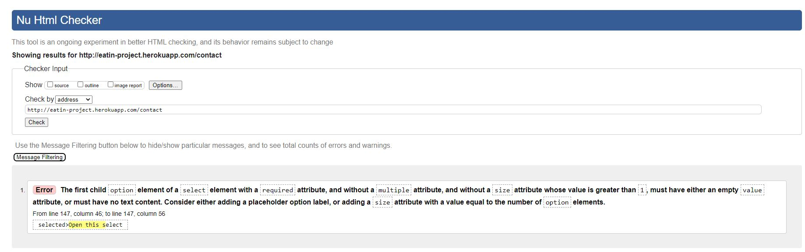
                    * Adjustments:
                        * label and value applied to first option
                - 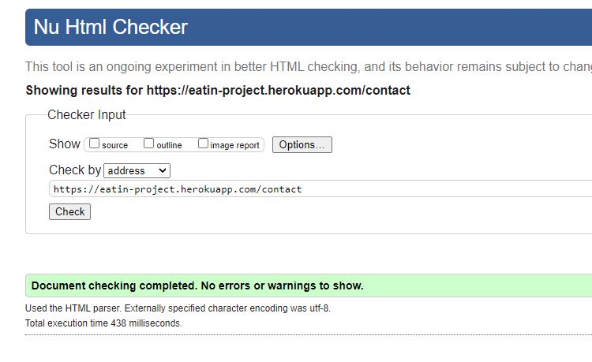
            * Edit Recipe
                - 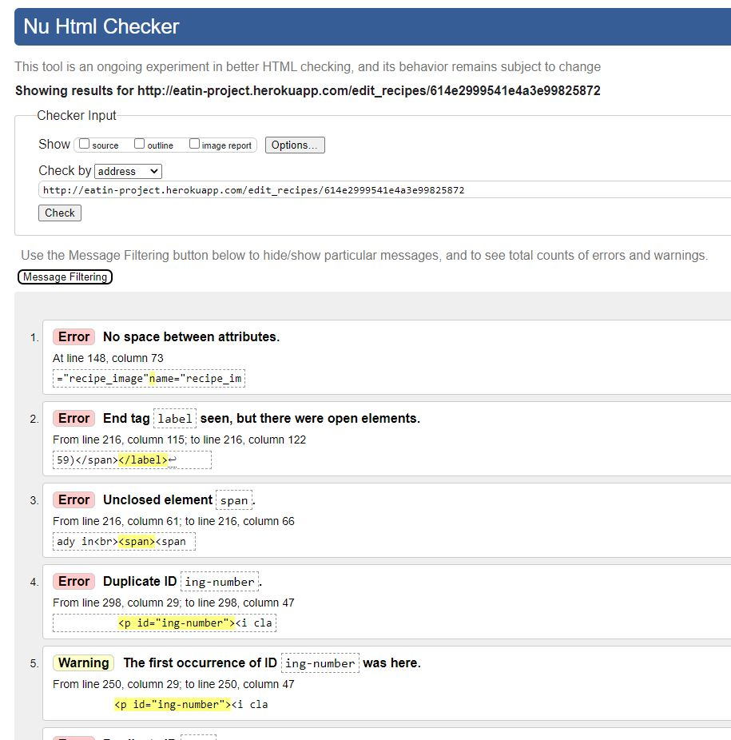
                    * Adjustments:
                        * id's not required removed, applied initially with view to styling...
                - 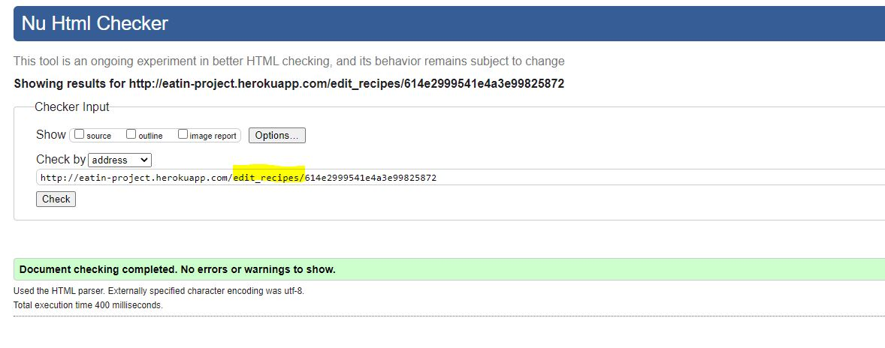
            
            * Profile
                - 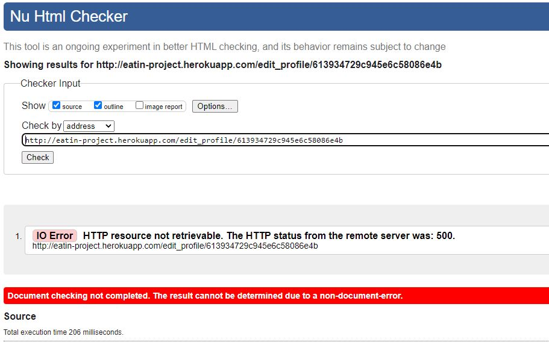
                    * Adjustments:
                        * Attempted to use validation section of validator but did not recognise user. Investigated online too and unable to find appropriate form of testing, however is working in current format.
            * Create Recipe
                - 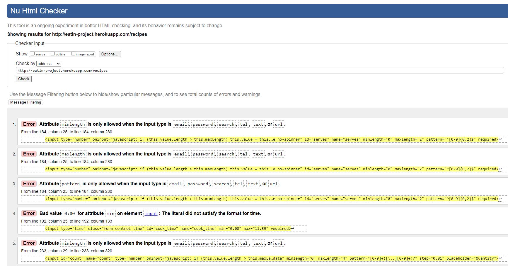
                    * Adjustments:
                        * type=number did not need pattern attribute and adjusted maxlength to max
                - 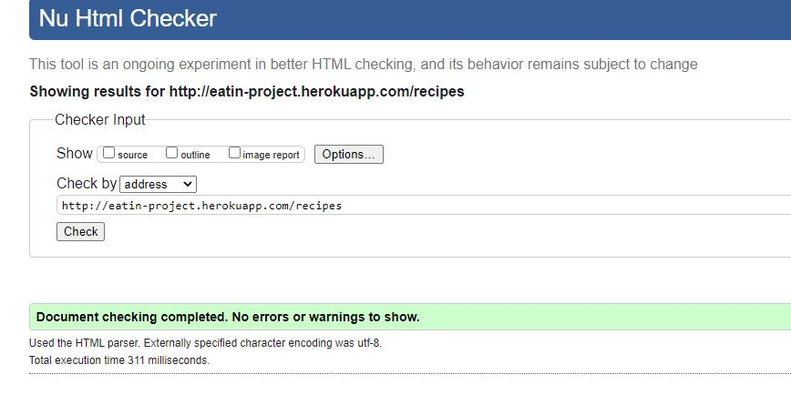
            * Show Breakfast, Lunch, Dinner, Dessert and Snack pages
                - 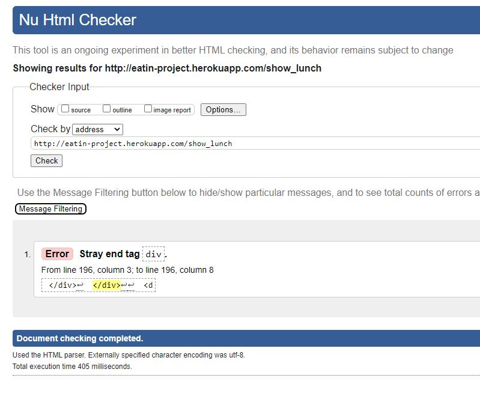
                    * Adjustments:
                        * Minor div removals and adjustments
                - 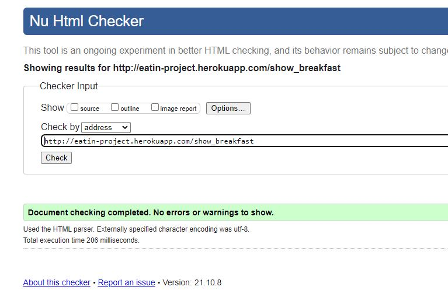

### CSS3
- [CSS code checker](https://jigsaw.w3.org/css-validator/)
    - Test date 09/10/2021
        - CSS3 code test
            - 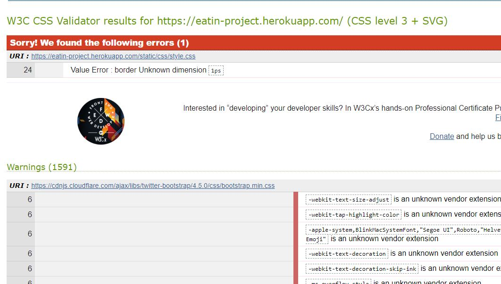
                * Adjustment of typo from ps to px
            - 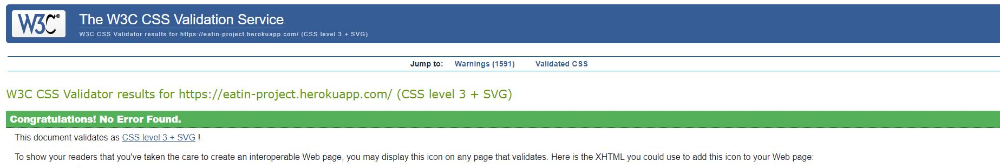
        - Bootstrap errors not directly code related

                
### JavaScript
- [JS Hint JavaScript validator](https://jshint.com/)

    - Test date 09/10/2021
        * Code issues
        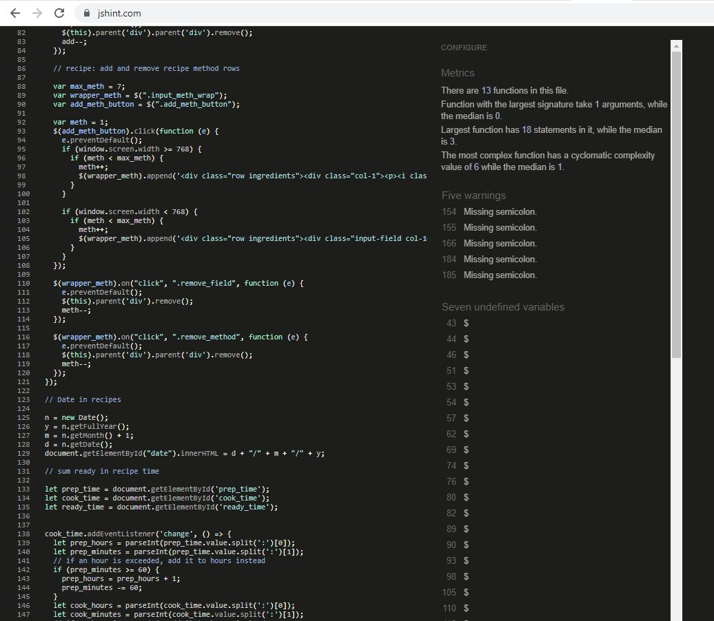
        * Warnings
            * missing semicolon minor errors
        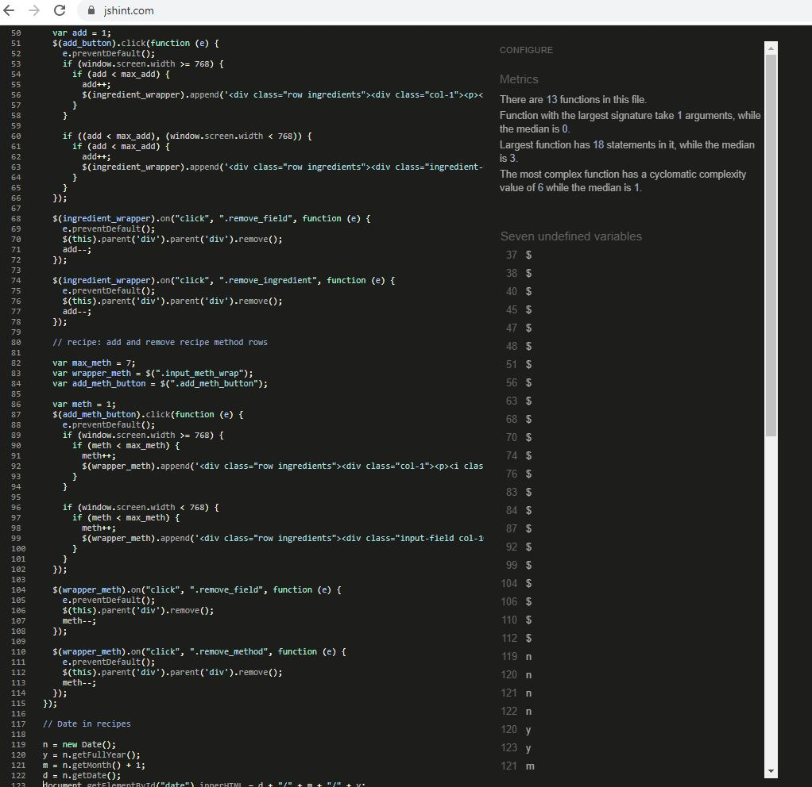
            * Updated semicolon errors
            * When attempting to update and rmeoval of unused variables various elements of code stop working like the menu feature.
                - After researching online have decided these are to be kept to ensure other functions can be enabled
        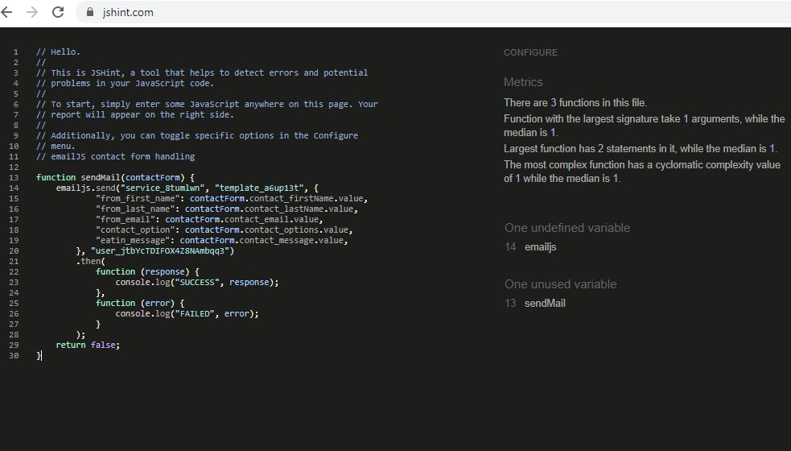
            * 1 Unused and 1 undefined variable but these are accepted with post through to email after online investigation

### PEP8
- [PEP8 requirement check](http://pep8online.com/)

    - Test date 09/10/2021
        * Code issues
        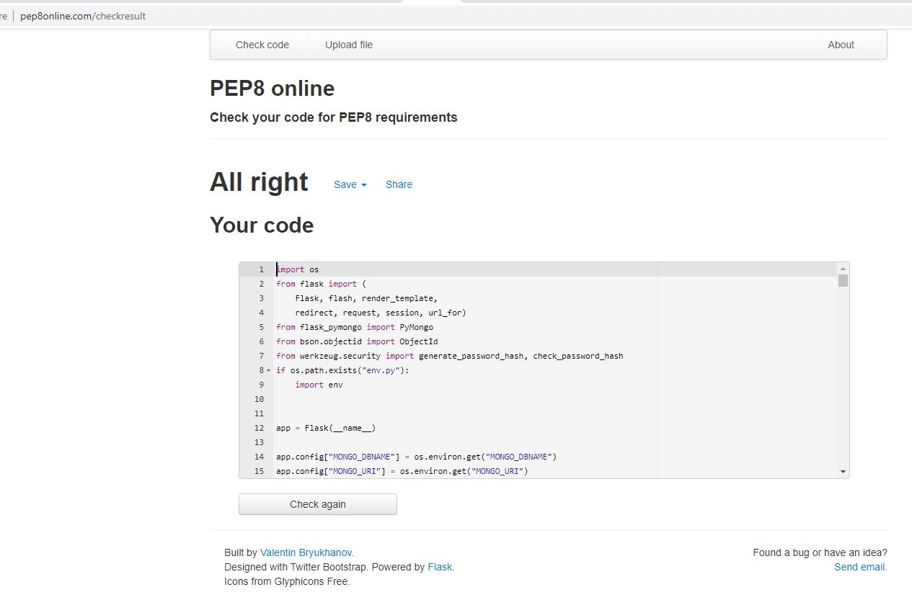
            * No Errors

[Back to top ⇧](#top)

## Element testing
### Navigation bar
- Test 
    * Responsive hover on click.
    * Links.

### Scroll Top button
- Test 
    * Button appears on scroll down and when pressed scrolls user to top

### Footer
- Test 
    * Social links change on hover
    * Social links lead to associated sites

[Back to top ⇧](#top)

### Page tests
#### Home
- Image
    * Nav links to other pages
    

[Back to top ⇧](#top)

#### Register
- Image
    * Appealing
- Inputs
    * First Name
    * Last Name
    * Email validation
    * Password hidden
    * Link to login if already registered
    

#### Login
- Image
    * Appealing
- Inputs
    * Email
    * Password hidden
    * Flash to display if incorrect
    * Link to Register if not a member
    

[Back to top ⇧](#top)

#### Login
- Image
    * Appealing
- Inputs
    * Email
    * Password hidden
    * Flash to display if incorrect
    * Link to Register if not a member
    

#### Browse
- Card images and text
    * Button to view recipe cards on each card
    * Search bar with text
    * Filter by recipe category
    

[Back to top ⇧](#top)

#### Profile
- Profile details
    * First name
    * Last name
    * Email
    * Edit account button
    * Delete Account button - with warning if selected
_ Recipe details
    * Public Recipes
        - View, Edit and Delete Options. Delete to have warning.
    * Private Recipes
        - View, Edit and Delete Options. Delete to have warning.
    

#### Edit Profile
- Ability to amend profile details
    * Cannot amend email as this is used as a username.
        - This can be deleted however
    

[Back to top ⇧](#top)

#### Create Recipe
- Recipe fields
    * Name
    * Description
    * Image (url image address)
    * Recipe type
    * Serves
    * Prep time
    * Cook time
    * Ready time (sum of pre and cook times)
    * Ingredients
        - Food
        - Quantity
        - Size
        - Weight (g)
        - Volume (lb)
    * Method steps
    * Public / Privcy switch
    * Save button
    * Cancel button
        - Warning if cancelling updates will be lost
    

#### Edit Recipe
- Recipe fields update with data previously entered
    * Update of info updates relevant fields
    

[Back to top ⇧](#top)

#### Contact Page
- Image
    * Appealing
- Fields
    * Contact fields are editable
    * All fields are required
    * Email field requires email format
    * Submit button works
    * Pop up appears to show success
    * Contact fields text is removed
    * Position returns to Home after submission
    - 

[Back to top ⇧](#top)

#### Email format
- Test
    * When email is submitted an email is sent to the developer with message from user
    * Auto reply to user stating an email has been received and they will be contacted
    * Email to have a link to the site
    - 

[Back to top ⇧](#top)

### Device testing
- [amiresponsive](http://ami.responsivedesign.is/)
    * Device styles and responsiveness for Mobile, Tablet and Desktop
    

[Back to top ⇧](#top)

### Colour blindness testing

#### Protanopia
- 

#### Deuteranopia
- 

[Back to top ⇧](#top)

### Browser testing
- Microsoft Edge browser testing
    * 

- Firefox browser testing
    * 
    * Nav design circle issue
        - identified d-block was the problem and have isolated in css
        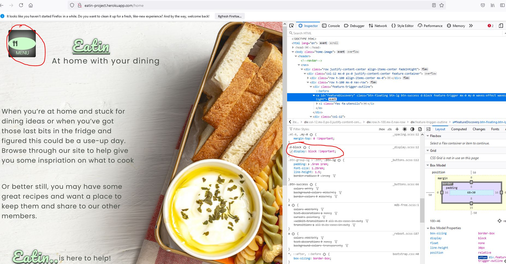
        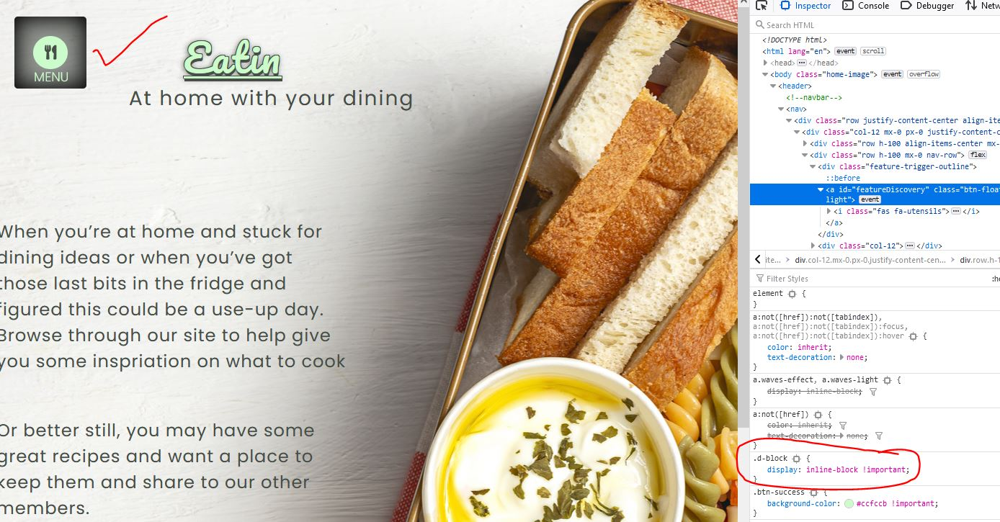

- Safari browser testing
    * Unable to test without making a purchase
    * Have been advised by Friends who own Macs design and interactivity was fine

[Back to top ⇧](#top)

### User testing
- Friends
- Family
- Website Designers

[Back to top ⇧](#top)

<h2 align="center">
    <a href="https://eatin-project.herokuapp.com/" target="_blank">Eatin Website</a>
</h2>

<h3 align="center">
    <a href="https://github.com/TezBaydu/Milestone-Project-3-cooking#README" target="_blank">Back to README file</a>
</h3>
